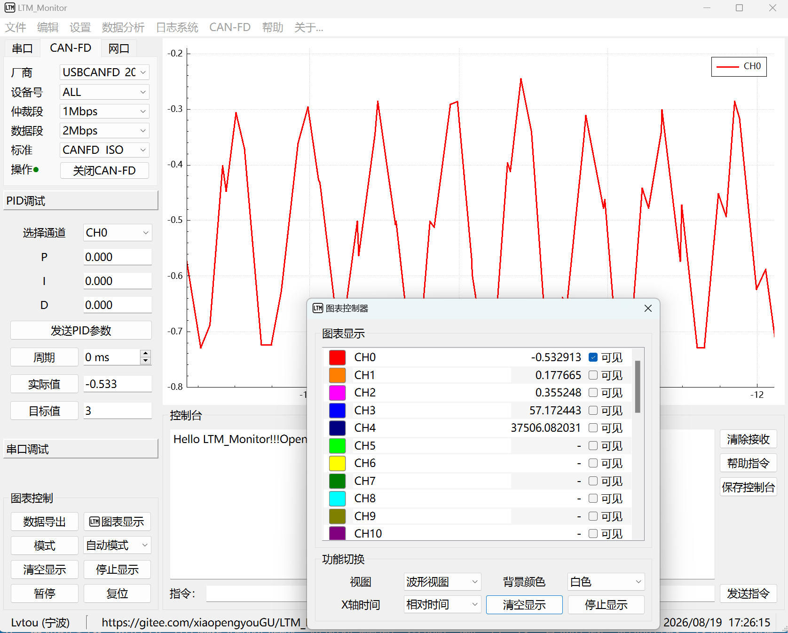
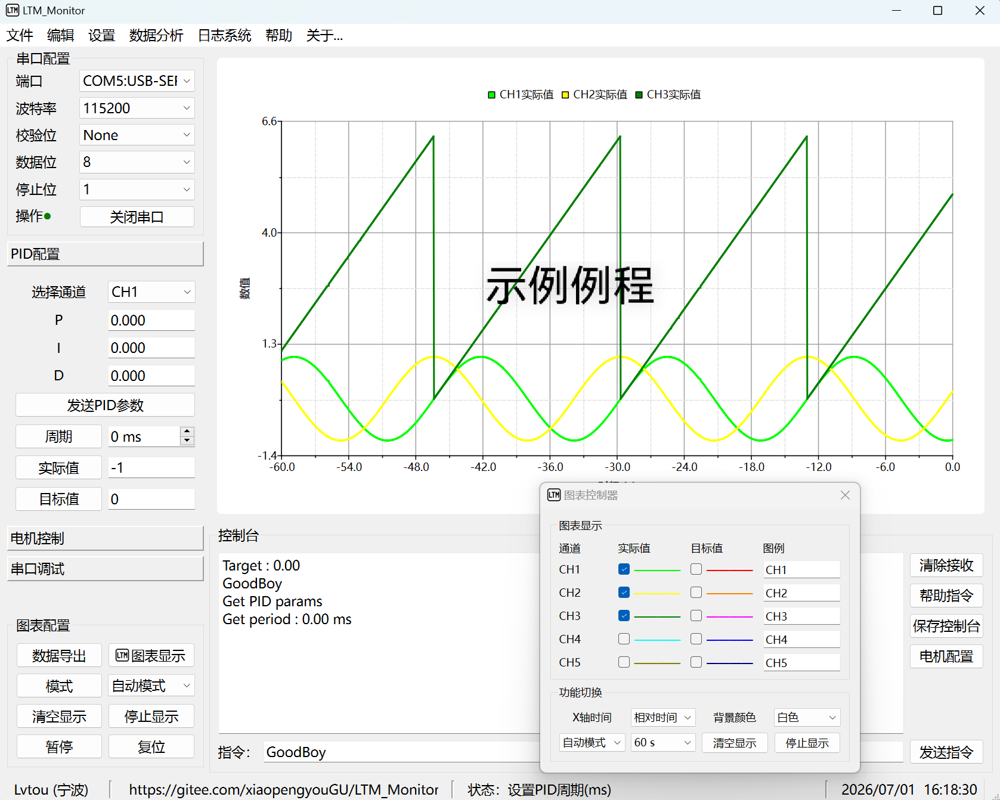
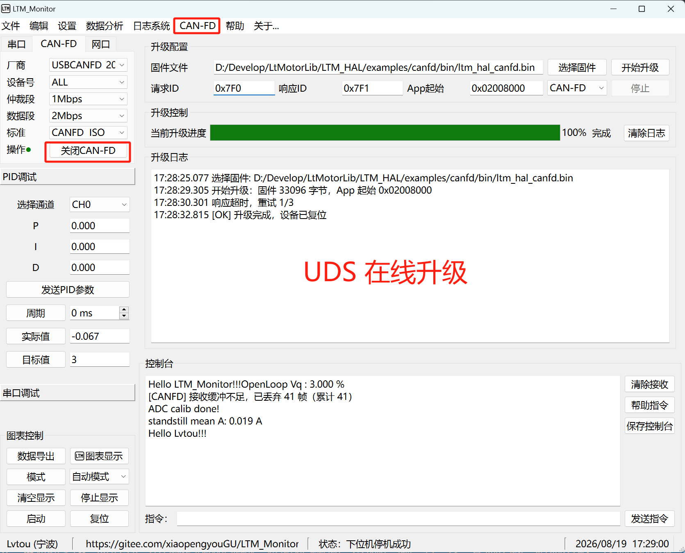

# LTM-Monitor – 基于 Qt6 的监控调试上位机

基于 **Qt 6** 开发的监控调试上位机，支持串口 / **网口（Ethernet TCP）** / CAN / CAN-FD / **LTM-over-CANFD** 通讯、
1000Hz 实时动态曲线（波形 / 频谱 / 波形+频谱 / XY / 四宫格）、最大支持 32 通道、在线 PID 调参、
CAN-FD 协议映射解析、**IAP/UDS 双通道烧录**、CSV 数据导出与**在线更新**。

## 安装包

当前版本 **v0.4.6**（2026-10-04），安装包见 [**安装包下载**](https://gitee.com/xiaopengyouGU/LTM_Monitor/releases/tag/LTM_Monitor_V0.4.0)（Windows 64 位，GPLv3 开源）。

安装目录内自带维护工具 `maintenancetool.exe`：程序启动时会自动检查一次新版本，也可在
**关于… → 检查更新** 手动检查。确认后程序退出、更新器接管，只下载有变化的组件（通常 2MB 左右），
不需要重新下载完整安装包。

## 软件界面

<div align="center">
    
    <p><em>主界面 - 串口 / 网口 / CAN-FD 通讯、实时曲线显示、数据记录</em></p>
</div>

<div align="center">
    
    <p><em>CAN-FD 界面 - CAN/CAN-FD通讯、数据记录、定时发送</em></p>
</div>

<div align="center">
    
    <p><em>UDS 升级界面 - 支持串口IAP和CAN-FD UDS在线升级 </em></p>
</div>

> 以上截图来自实际运行环境，界面可能因版本更新略有差异。

---

## 核心特性

- **1000Hz 实时曲线流畅不卡**：传输层批量转发（按批投递，非逐帧跨线程）、数据线程集中解析、
  图表环形缓冲 + LTTB 降采样，实测 1000Hz 曲线与表格刷新丝滑。
- **一套 LTM 协议跑三种介质**：串口 / 网口 / CAN-FD 共用同一套 LTM 协议（CAN-FD 走 0x100 下行广播 /
  0x101 上行上报，收发分 ID，多电机总线不冲突），协议层与传输层完全解耦。
- **网口通讯（Ethernet TCP Client）**：上位机主动连接设备，本机网卡与设备端口可选；网口有独立的
  LTM 解析状态，与串口互不污染。发送按 串口 → 网口 → CAN-FD 顺序选路，接哪个用哪个。
- **协议解析组件化**：LTM / Modbus 协议器、环形缓冲、CRC16 全部收在 `components/protocol`
  （Pimpl，与介质无关），串口 / 网口 / CAN-FD 共用一套解析。
- **CAN-FD 协议映射**：DBC / JSON 协议导入（DataMap），信号级解码 + 图表映射表，免改代码适配新报文。
- **IAP / UDS 双通道烧录**：串口 IAP（LTM 协议）+ CAN-FD UDS（ISO-TP），配合 BootLoader
  实现产线/现场升级，调试烧录一条龙。
- **动态 PID 调参**：实际值高精度刷新（动态小数位），手动下位PID参数和目标值。
- **CSV 数据导出**：时间戳保留 4 位小数，通道数值动态小数位，可配置导出时长。
- **高频健壮性**：CAN-FD 积压帧过滤（避免恢复读取时时间轴突跳）、丢帧限频提示、源头格式化
  （表格行在数据线程格式化，UI 零字符串加工）。
- **在线更新**：更新仓库放在 Gitee 的一个分支，安装包按功能拆成 6 个组件；改一次上位机，客户端
  只拉有变化的组件，索引与包完整性由仓库里的 SHA1 校验。

## 通讯协议移植

本项目定义了一套轻量级的**通讯协议**（LTM 协议），用于上位机与下位机（如单片机）之间的数据交换。
协议设计简洁（9 种数据类型、单帧 ≤134B、CRC16 校验），易于移植到各种嵌入式平台，
且**与硬件无关**——同一套协议可跑串口，也可经 CAN-FD 承载（LTM-over-CANFD）。

协议源码位于 **`examples/protocol/`** 目录，采用纯 C 语言实现，无额外依赖，可直接集成到 ARM Cortex-M 等平台。

同时，笔者在 **`examples/`** 目录下提供了完整的 **STM32 和 Renesas 的协议移植示例**，包含：

- 串口收发驱动适配（UART）与 CAN-FD 承载适配（LTM-over-CANFD）
- 用户自定义接收处理函数 (user_func)
- 与上位机联调的演示代码（见 while 主循环）

如果你需要将通讯协议移植到其他单片机（如 GD32、ESP32 等），可参考该示例进行适配。
具体使用方法请直接阅读示例工程中的源码注释。

## 项目架构

详细架构说明（分层 / 线程模型 / 数据流 / 代码约定）：[ARCHITECTURE.md](documents/ARCHITECTURE.md)

三层分离，模块间零协议侵入：

```
传输层（modules）              协议层（components）                组合层（DataHub）
serial   —— 纯字节收发      protocol/LTM_Protocol  ──┐
ethernet —— TCP 字节收发    protocol/Modbus_Protocol ─┼─→ 字节流 → 协议解析 → 图表/PID/命令分发
canfd    —— 纯帧收发        protocol/Modbus_Master ──┘   发送路由：串口 → 网口 → CAN-FD 0x100
```

- **传输层**（`modules/serial`、`modules/ethernet`、`modules/canfd`）：只做设备管理、字节/帧收发、轮询
  与连接状态上报，不感知任何协议。
- **协议层**（`components/protocol`）：LTM / Modbus 打包拆包、环形缓冲、CRC16、Modbus 主站事务器，
  全部 Pimpl，与介质无关，可独立测试。
- **组合层**（`DataHub`，位于 `ui_widgets/main_window`）：串口 / 网口字节按协议模式分发、
  CAN-FD 0x101 上行 LTM 解析、发送统一路由（串口在线走串口，其次网口，最后 CAN-FD 0x100 分片）。

## 项目目录结构

```
LTM_Monitor/
├── examples/                  # 示例工程（通讯协议移植参考）
│   ├── BootLoader/            # 串口IAP和CAN-FD UDS 在线升级 BootLoader
│   ├── protocol/              # 通讯协议实现（C语言，串口 + CAN-FD 承载）
│   ├── STM32/                 # STM32F103C8T6 最小系统板移植示例
│   └── Renesas/               # 野火 RA6T2 电机开发板移植示例
├── src/
│   ├── modules/               # 传输层与核心能力库
│   │   ├── chart/             # 图表动态库（5 类视图、LTTB/M4 降采样、FFT、导入导出）
│   │   ├── serial/            # 串口传输动态库（字节收发）
│   │   ├── ethernet/          # 网口传输动态库（TCP Client 字节收发）
│   │   ├── canfd/             # CAN-FD 传输动态库（帧收发、厂商 SDK 隔离）
│   │   └── record/            # 数据记录动态库（数据库与日志系统）
│   ├── components/            # 协议/映射层组件（与介质无关）
│   │   ├── protocol/          # LTM / Modbus 协议器、环形缓冲、CRC16、Modbus 主站（Pimpl）
│   │   ├── data_map/          # CAN 数据映射（DBC / JSON 协议解析）
│   │   ├── chart_map/         # 统一图表映射表（信号 → 通道）
│   │   ├── uds_server/        # UDS 升级服务（IAP/UDS 双通道共用）
│   │   └── status_bar/        # 自定义状态栏
│   ├── ui_widgets/
│   │   ├── main_window/       # 主窗口 + DataHub（协议组合层）+ 在线更新检查
│   │   ├── chart_dialog/      # 图表设置对话框
│   │   ├── canfd_widget/      # CAN-FD 分析界面（表格抓包 + 映射）
│   │   ├── uds_widget/        # UDS/IAP 升级界面
│   │   ├── map_table/         # 图表映射表编辑器
│   │   └── log_analysis/      # 日志分析器
│   └── application/
│       └── main.cpp           # 主程序入口
├── CMakeLists.txt
├── script.py                  # 构建辅助脚本
└── README.md
```

## 许可证

本仓库分层授权，按目录区分：

| 路径 | 许可证 | 说明 |
| --- | --- | --- |
| `src/`、`CMakeLists.txt`、`documents/` | **GPLv3** | 上位机全部源码与文档，全文见根目录 [`LICENSE`](LICENSE) |
| 安装包工程（本仓库 `installer_project` 分支） | **GPLv3** | 安装器配置、组件定义与发布脚本 |
| `examples/protocol/` | **MIT** | 通讯协议本体（纯 C、无依赖），可自由集成到闭源固件，只需保留版权与许可声明，全文见 [`examples/protocol/LICENSE`](examples/protocol/LICENSE) |
| `examples/STM32/`、`examples/Renesas/` | **GPLv3** | 协议移植示例工程；内嵌的 `protocol/` 副本来自 MIT 的协议本体 |
| `examples/BootLoader/` | **GPLv3** | 串口 IAP / CAN-FD UDS 下位机示例；`core/protocol/` 副本同样来自 MIT 协议本体 |
| `src/**/third_party/` | 各自许可 | QCustomPlot（GPLv3）、spdlog（MIT）、ZLG zcan 厂商 SDK（随厂商授权） |

一句话：**上位机 GPLv3，协议本体 MIT**——把协议搬进自己固件的人不必开源固件；改上位机则需遵守 GPLv3。
