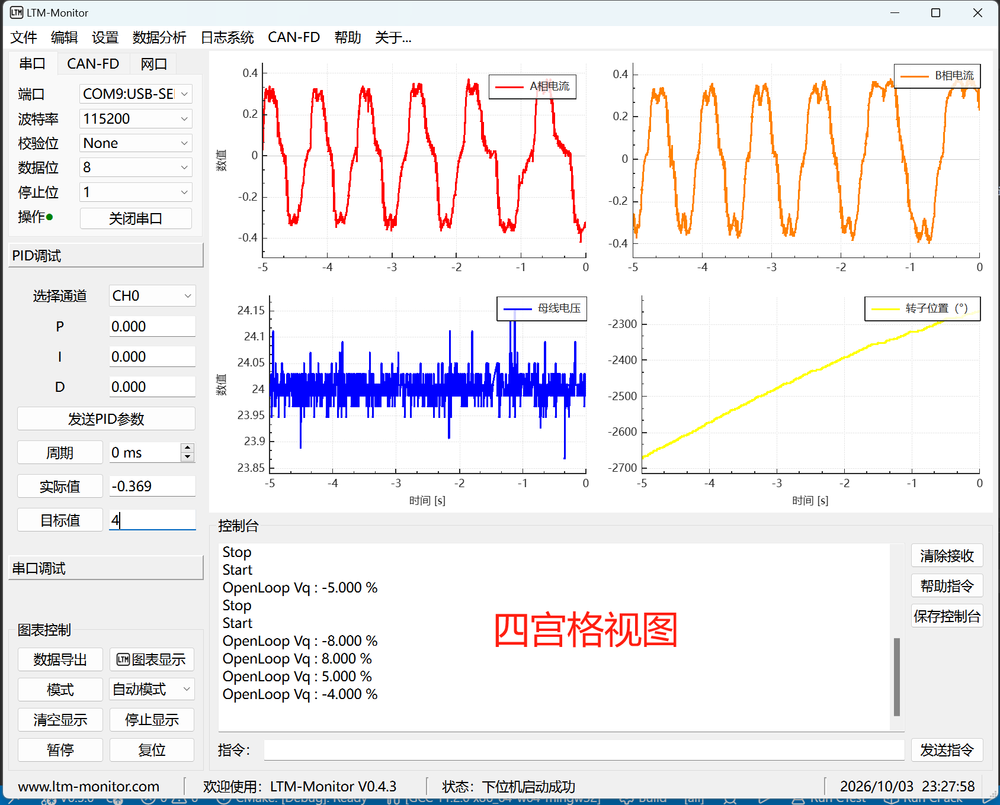

# LTM_Monitor – 基于Qt6的上位机监控调试软件

基于 **Qt 6** 开发的上位机监控调试软件，支持串口通讯、动态曲线显示、在线PID调参、CSV数据导出等功能。

## 安装包

安装包 **LTM_Monitor_Installer.exe** 在 **bin** 文件夹下，双击即可启动安装。

## 软件界面

<div align="center">
    
    <p><em>主界面 - 串口通讯、实时曲线显示、数据记录</em></p>
</div>

<div align="center">
    
    <p><em>主界面 - 串口通讯、实时曲线显示、数据记录</em></p>
</div>

> 以上截图来自实际运行环境，界面可能因版本更新略有差异。

---

## 通讯协议移植

本项目定义了一套轻量级的**通讯协议**，用于上位机与下位机（如单片机）之间的数据交换。协议设计简洁，易于移植到各种嵌入式平台。

协议源码位于 **`examples/protocol/`** 目录，采用纯 C 语言实现，无额外依赖，可直接集成到 ARM Cortex-M 等平台。

同时，笔者在 **`examples/STM32/`** 目录下提供了一个完整的 **STM32F103C8T6 最小系统板移植示例**，包含：
- 串口收发驱动适配（UART）
- 用户自定义接收处理函数 (user_func)
- 与上位机联调的演示代码 (见 while主循环)

示例例程运行结果如下图所示：

<div align="center">
    
    <p><em>示例例程结果 - 串口通讯、实时曲线显示、数据记录</em></p>
</div>

如果你需要将通讯协议移植到其他单片机（如 GD32、ESP32 等），可参考该示例进行适配。具体使用方法请直接阅读示例工程中的源码注释。


## 项目目录结构
```
LTM_Monitor/
├── example/                   # 示例工程（通讯协议移植参考）
│   ├── protocol/              # 通讯协议实现（C语言）
│   └── STM32/                 # STM32F103C8T6 最小系统板移植示例
├── src/
│   ├── modules/               # 动态库模块
│   │   ├── chart/             # 图表动态库（提供实时曲线功能）
│   │   ├── serial/            # 串口通讯动态库
│   │   └── record/            # 数据记录动态库（数据库与日志系统）
│   ├── ui_widgets/
│   │   ├── chart_dialog/      # 图表设置对话框
│   │   └── main_window/       # 主窗口
│   └── application/
│       └── main.cpp           # 主程序入口
├── CMakeLists.txt
├── script.py                  # 构建辅助脚本
└── README.md
```


本项目基于 **GNU General Public License (GPL)** 开源，详细条款请见项目中的 `LICENSE` 文件。
```